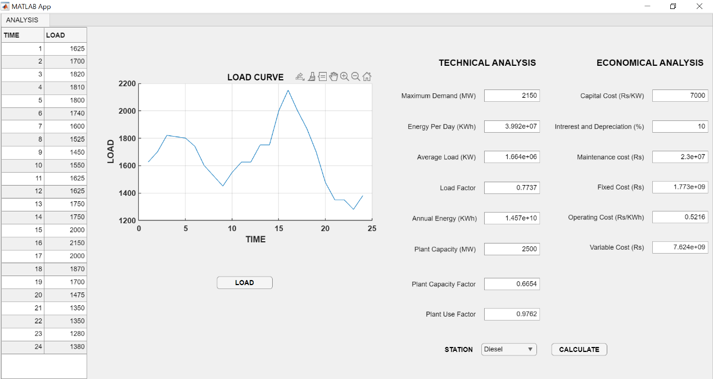

# PG-CEP
Prepared a generating station cost analysis and design for a load profile, with diesel and nuclear as the selected options, as part of a Complex Engineering Problem (CEP) for the EE-414 Power Generation course in BE-Electrical Engineering at NEDUET.

## Problem Statement ##
This project involves designing and analyzing two types of electrical power-generating stations based on a selected daily load profile. The goal is to evaluate and compare both power stations' technical and economical parameters, using appropriate software tools such as MATLAB. The analysis will include layout plans, comparative tables, and graphical results. Additionally, the environmental and sustainability impacts of each power station will be assessed to propose an optimal power generation solution for global implementation. The solution must be justified through sufficient references from books, research papers, and authentic web sources. Further details can be found [here.](https://github.com/InvincibleFrog/PG-CEP/blob/main/CEP%20PG%20batch%202020.pdf)

## Project Report
Details of the project are summarised in the [Project Report](https://github.com/InvincibleFrog/PG-CEP/blob/main/PG_CEP-merged.pdf).

## Deliverables
MATLAB GUI Application

A GUI application developed using MATLAB App Designer R2024b for the technical and economic analysis of a load profile based on 2 generating stations. It loads and plots data for one daily load profile at a time.

Allows user to calculate:-

Technical Parameters: Maximum Demand, Energy Per Day, Average Load, Load Factor, Annual Energy, Plant Capacity, Plant Capacity Factor, Plant Use Factor

Economical Parameters: Capital Cost, Interest and Depreciation, Maintenance Cost, Fixed Cost, Operating Cost, Variable Cost

**Selected Generating Stations are:**
1. Nuclear Power Station 
2. Diesel Power Station

## THE MAIN CODE FOR THE GUI IS AVAILABLE ##
[GUI Code](https://github.com/InvincibleFrog/PG-CEP/blob/main/PG_CEP.mlapp)
