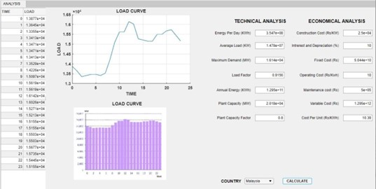

# PG-CEP
Prepared a generating station cost analysis and design for a load profile, with diesel and nuclear as the selected options, as part of a Complex Engineering Problem (CEP) for the EE-414 Power Generation course in BE-Electrical Engineering at NEDUET.

## Project Report
Details of the project are summarised in the [Project Report](https://github.com/moeed17/PG-CEP/blob/main/PG%20CEP%20Report.pdf).

## Deliverables
MATLAB GUI Application

A GUI application developed using MATLAB App Designer R2024b for the technical and economic analysis of a load profile based on 2 generating stations. It loads and plots data for one daily load profile at a time.

Allows user to calculate:-

Technical Parameters: Maximum Demand, Energy Per Day, Average Load, Load Factor, Annual Energy, Plant Capacity, Plant Capacity Factor, Plant Use Factor

Economical Parameters: Capital Cost, Interest and Depreciation, Maintenance Cost, Fixed Cost, Operating Cost, Variable Cost

**Selected Generating Stations are:**
1. Nuclear Power Station 
2. Diesel Power Station
